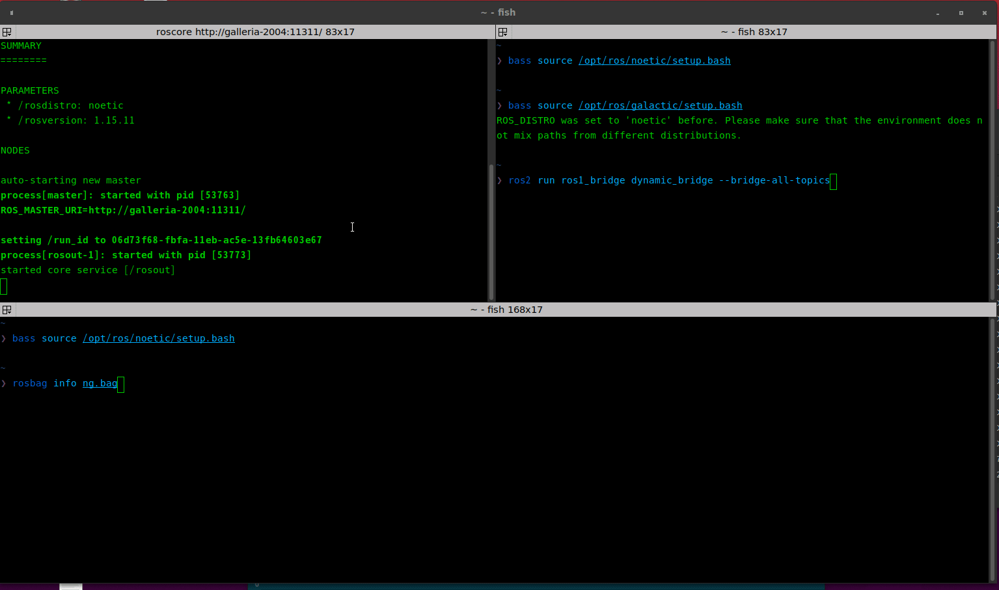
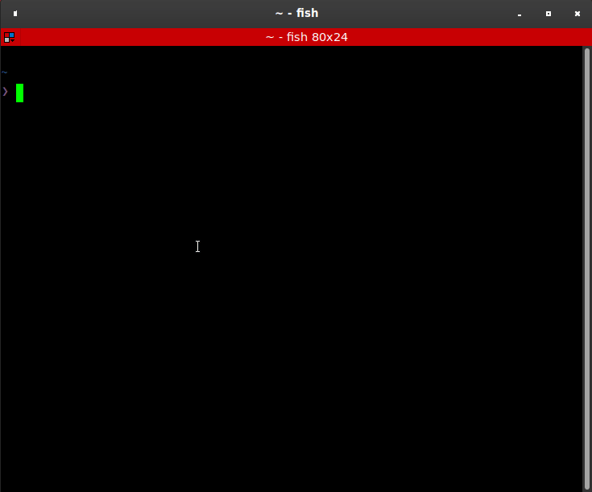

# Bag Topic Reanmer
This package renames topic names that are invalid in ROS2.

## Requirements
- Ubuntu 20.04
- ROS1 noetic

## Problem
In ROS2, topic name token starts with number cannot use, though it's no problem in ROS1.



## Solution
If you want to convert ros1 bag includes invalid topic name(s), you have to rename topic name.
This package rename invalid topic name and rebuild bag.

## Usage
```
# clone this repository, build, and source workspace that includes this package
rosrun bag_topic_reanmer renamer.py -i $(bag_path) -p $(prefix)
```



